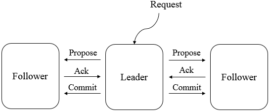
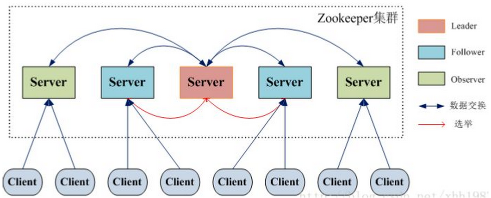

## ZooKeeper简介

ZooKeeper 是 Apache 的一个顶级项目，为分布式应用提供高效、高可用的分布式协调服务。由雅虎创建，是Google **Chubby的开源实现**。

ZooKeeper是一个开源的分布式协调服务，其设计目标是将那些复杂的且容易出错的分布式一致性服务封装起来，构成一个高效可靠的原语集，并以一些列简单的接口提供给用户使用。其是一个典型的分布式数据一致性的解决方案，分布式应用程序可以基于它实现诸如数据发布/发布、负载均衡、命名服务、分布式协调/通知、集群管理、Master选举、分布式锁和分布式队列等功能。

虽然可以从头开始设计和实现所有这些服务，但调试任何问题、竞争条件或死锁都需要执行额外的工作，并且很难实现。就像您不会在代码中随处编写自己的随机数发生器或哈希函数一样，这里有一个要求：人们不应该在每次有需要时就到处从头编写自己的名称服务或领导者选举服务。此外，您可以相对容易地一起解决一个非常简单的组成员服务，但是，要编写它们来提供可靠性、复制和可扩展性，可能需要做更多的工作。这导致了Apache ZooKeeper的开发和开源，Apache ZooKeeper是一个针对分布式系统的、开箱即用的、可靠的、可扩展的、高性能的协调服务。

ZooKeeper 虽然是一个针对分布式系统的协调服务，但它本身也是一个分布式应用程序。ZooKeeper 遵循一个简单的客户端-服务器模型，其中客户端 是使用服务的节点（即机器），而服务器 是提供服务的节点。ZooKeeper 服务器的集合形成了一个 ZooKeeper 集合体（ensemble）。在任何给定的时间内，一个 ZooKeeper 客户端可连接到一个 ZooKeeper 服务器。每个 ZooKeeper 服务器都可以同时处理大量客户端连接。每个客户端定期发送 ping 到它所连接的 ZooKeeper 服务器，让服务器知道它处于活动和连接状态。被询问的 ZooKeeper 服务器通过 ping 确认进行响应，表示服务器也处于活动状态。如果客户端在指定时间内没有收到服务器的确认，那么客户端会连接到集合体中的另一台服务器，而且客户端会话会被透明地转移到新的 ZooKeeper 服务器。

## 一致性特性

- ① **顺序一致性**，从同一个客户端发起的事务请求，最终将会严格地按照其发起顺序被应用到ZooKeeper中去。ZooKeeper以ZXID来保证事务的顺序性。
- ② **原子性**，所有事务请求的处理结果在整个集群中所有机器上的应用情况是一致的，即整个集群要么都成功应用了某个事务，要么都没有应用。ZooKeeper以ZAB保证原子操作，要么成功，要么失败。
- ③ **单一视图**，无论客户端连接的是哪个ZooKeeper服务器，其看到的服务端数据模型都是一致的。
- ④ **可靠性**，一旦服务端成功地应用了一个事务，并完成对客户端的响应，那么该事务所引起的服务端状态变更将会一直被保留，除非有另一个事务对其进行了变更。ZooKeeper以版本来实现“写入校验”，保证数据的写入正确性。
- ⑤ **实时性**，ZooKeeper保证在一定的时间段内，客户端最终一定能够从服务端上读取到最新的数据状态。ZooKeeper以性能来保证实时性。

## 设计目标

ZooKeeper致力于提供一个高性能、高可用、且具有严格的顺序访问控制能力（主要是写操作的严格顺序性）的分布式协调服务，其具有如下的设计目标。

- ① **简单的数据模型**，ZooKeeper使得分布式程序能够通过一个共享的树形结构的名字空间来进行相互协调，即ZooKeeper服务器内存中的数据模型由一系列被称为ZNode的数据节点组成，**ZooKeeper将全量的数据存储在内存中，以此来提高服务器吞吐、减少延迟的目的**。类似于传统文件系统的“树”结构，Znode用绝对路径标识。

  - 核心在于数据节点Znode，Znode可保存数据可挂载子节点 
  - 节点用路径标识
  - 树结构
  - 事务：每个能够改变ZooKeeper服务器状态的操作，如Znode的创建和删除、Znode的数据更新等
  - 每个事务都会分配一个事务ID(ZXID)用于标识

- ② **可构建集群**，一个ZooKeeper集群通常由一组机器构成，组成ZooKeeper集群的每台机器都会在内存中维护当前服务器状态，并且每台机器之间都相互通信。可以通过多个ZooKeeper服务器组建集群，以leader+follower+observer的形式组成，满足“过半存活”即可用，推荐集群数为单数3、5、7…等。

- ③ **顺序访问**，对于来自客户端的每个更新请求，ZooKeeper都会分配一个全局唯一的递增编号，这个编号反映了所有事务操作的先后顺序。用ZXID的递增来保证事务的顺序性。

- ④ **高性能**，ZooKeeper将全量数据存储在内存中，并直接服务于客户端的所有非事务请求，因此它尤其适用于以读操作为主的应用场景。读性能/写性能 = 10:1。

## 基本概念

- ① **集群角色**，最典型的集群就是Master/Slave模式（主备模式），此情况下把所有能够处理写操作的机器称为Master机器，把所有通过异步复制方式获取最新数据，并提供读服务的机器为Slave机器。ZooKeeper引入了Leader、Follower、Observer三种角色，ZooKeeper集群中的所有机器通过Leaser选举过程来选定一台被称为Leader的机器，Leader服务器为客户端提供写服务，Follower和Observer提供读服务，但是**Observer不参与Leader选举过程**，**不参与写操作**的**过半写成功**策略，Observer可以在不影响写性能的情况下提升集群的性能。

- ② **会话（Session）**，指客户端会话，**一个客户端连接是指客户端和服务端之间的一个TCP长连接**，ZooKeeper对外的服务端口默认为2181，客户端启动的时候，首先会与服务器建立一个TCP连接，从第一次连接建立开始，客户端会话的生命周期也开始了，通过这个连接，客户端能够心跳检测与服务器保持有效的会话，也能够向ZooKeeper服务器发送请求并接受响应，同时还能够通过该连接接受来自服务器的Watch事件通知。Session的**SessionTimeout**值用来设置一个客户端会话的**超时时间**。当由于服务器压力太大、网络故障或是客户端主动断开连接等各种原因导致客户端连接断开时，只要在SessionTimeout规定的时间内能够**重新连接上**集群中**任意一台**服务器，那么之前创建的会话**仍然有效**。

- ③ **数据节点（ZNode）**，第一类指构成集群的机器，称为**机器节点**，第二类是指数据模型中的**数据单元**，称为数据节点-Znode，ZooKeeper将**所有数据存储在内存中**，数据模型是一棵树，由斜杠`/`进行分割的路径，就是一个ZNode，如`/foo/path1`，每个ZNode都会保存自己的数据内存，同时还会保存一些列属性信息。ZNode分为**持久节点**和**临时节点**两类，持久节点是指一旦这个ZNode被创建了，**除非主动进行ZNode的移除操作，否则这个ZNode将一直保存在ZooKeeper上**，而**临时节点的生命周期和客户端会话绑定，一旦客户端会话失效，那么这个客户端创建的所有临时节点都会被移除**。另外，ZooKeeper还允许用户为每个节点添加一个特殊的属性：**SEQUENTIAL**。一旦节点被标记上这个属性，那么在这个节点被创建的时候，ZooKeeper会自动在其节点后面追加一个整形数字，其是由父节点维护的自增数字。

  - 持久节点：直到被显示删除

  - 临时节点：直到会话结束，不能挂载子节点

  节点上会存储znode的信息，如znode的版本信息、znode子节点的版本信息、znode_acl的版本信息、子节点数、节点数据等信息


- ④ **版本**，对于每个ZNode，ZooKeeper都会为其维护一个叫作Stat的数据结构，Stat记录了这个ZNode的三个数据版本，分别是version（当前ZNode的版本）、cversion（当前ZNode子节点的版本）、aversion（当前ZNode的ACL版本）。版本用于写入校验，当节点更新数据时发现版本号已经更改就会抛出异常。

- ⑤ **Watcher（事件监听器）**，是ZooKeeper中一个很重要的特性。ZooKeeper允许用户在指定节点上注册一些Watcher，并且在一些特定事件触发的时候，ZooKeeper服务端会将事件通知到感兴趣的客户端。客户端向ZooKeeper服务器注册Wathcer的同时会将Watcher对象存储在客户端的WatchManger中。当ZooKeeper触发Watcher事件后，会向client发通知，client会从WM中对Watcher执行回调。

- ⑥ **ACL**，ZooKeeper采用ACL（Access Control Lists）策略来进行权限控制，其定义了如下五种权限：
  - **CREATE**：创建子节点的权限。
  - **READ**：获取节点数据和子节点列表的权限。
  - **WRITE**：更新节点数据的权限。
  - **DELETE**：删除子节点的权限。
  - **ADMIN**：设置节点ACL的权限。

  注意：CREATE 和 DELETE 都是针对子节点的权限控制。

- ⑦**状态信息**：每个ZNode除了存储数据内容之外，还存储了ZNode本身的一些状态信息。用 get 命令可以同时获得某个ZNode的内容和状态信息。在ZooKeeper中，version属性是用来实现乐观锁机制中的『写入校验』的（保证分布式数据原子性操作）。

- ⑧**事务操作**：在ZooKeeper中，能改变ZooKeeper服务器状态的操作称为事务操作。一般包括数据节点创建与删除、数据内容更新和客户端会话创建与失效等操作。对应每一个事务请求，ZooKeeper都会为其分配一个全局唯一的事务ID，用ZXID表示，通常是一个64位的数字。每一个ZXID对应一次更新操作，从这些ZXID中可以间接地识别出ZooKeeper处理这些事务操作请求的全局顺序。


## ZAB协议

Zookeeper使用了Zookeeper Atomic Broadcast（ZAB，Zookeeper原子消息广播协议）的协议作为其数据一致性的核心算法。ZAB协议是为Zookeeper专门设计的一种**支持崩溃恢复的原子广播协议。**

Zookeeper依赖ZAB协议来实现分布式数据的一致性，基于该协议，Zookeeper实现了一种主备模式的系统架构来保持集群中各副本之间的数据的一致性，即其使用一个单一的主进程来接收并处理客户端的所有事务请求，并采用ZAB的原子广播协议，将服务器数据的状态变更以事务Proposal的形式广播到所有的副本进程中，ZAB协议的主备模型架构保证了同一时刻集群中只能够有一个主进程来广播服务器的状态变更，因此能够很好地处理客户端大量的并发请求。

ZAB协议的核心是定义了对于那些会改变Zookeeper服务器数据状态的事务请求的处理方式，即：**所有事务请求必须由一个全局唯一的服务器来协调处理**，这样的服务器被称为Leader服务器，余下的服务器则称为Follower服务器，Leader服务器负责将一个客户端事务请求转化成一个事务Proposal（提议），并将该Proposal分发给集群中所有的Follower服务器，之后Leader服务器需要等待所有Follower服务器的反馈，一旦超过半数的Follower服务器进行了正确的反馈后，那么Leader就会再次向所有的Follower服务器分发Commit消息，要求其将前一个Proposal进行提交。

ZAB协议包括两种基本的模式：**崩溃恢复（选主）**和**消息广播（同步）**。

当整个服务框架启动过程中或Leader服务器出现网络中断、崩溃退出与重启等异常情况时，ZAB协议就会进入恢复模式并选举产生新的Leader服务器。当选举产生了新的Leader服务器，同时集群中已经有过半的机器与该Leader服务器完成了状态同步之后，ZAB协议就会退出恢复模式，状态同步是指数据同步，用来保证集群在过半的机器能够和Leader服务器的数据状态保持一致。

当集群中已经有过半的Follower服务器完成了和Leader服务器的状态同步，那么整个服务框架就可以进入**消息广播模式，**当一台同样遵守ZAB协议的服务器启动后加入到集群中，如果此时集群中已经存在一个Leader服务器在负责进行消息广播，那么加入的服务器就会自觉地进入**数据恢复模式：找到Leader所在的服务器，并与其进行数据同步，然后一起参与到消息广播流程中去。**Zookeeper只允许唯一的一个Leader服务器来进行事务请求的处理，Leader服务器在接收到客户端的事务请求后，会生成对应的事务提议并发起一轮广播协议，而如果集群中的其他机器收到客户端的事务请求后，那么这些非Leader服务器会首先将这个事务请求转发给Leader服务器。

当Leader服务器出现崩溃或者机器重启、集群中已经不存在过半的服务器与Leader服务器保持正常通信时，那么在重新开始新的一轮的原子广播事务操作之前，所有进程首先会使用崩溃恢复协议来使彼此到达一致状态，于是整个ZAB流程就会从消息广播模式进入到崩溃恢复模式。一个机器要成为新的Leader，必须获得过半机器的支持，同时由于每个机器都有可能会崩溃，因此，ZAB协议运行过程中，前后会出现多个Leader，并且每台机器也有可能会多次成为Leader，进入崩溃恢复模式后，只要集群中存在过半的服务器能够彼此进行正常通信，那么就可以产生一个新的Leader并再次进入消息广播模式。如一个由三台机器组成的ZAB服务，通常由一个Leader、2个Follower服务器组成，某一个时刻，加入其中一个Follower挂了，整个ZAB集群是不会中断服务的。

### ① 消息广播

ZAB协议的消息广播过程使用原子广播协议，类似于一个二阶段提交过程，针对客户端的事务请求，Leader服务器会为其生成对应的事务Proposal，并将其发送给集群中其余所有的机器，然后再分别收集各自的选票，最后进行事务提交。



在ZAB的二阶段提交过程中，移除了中断逻辑，所有的Follower服务器要么正常反馈Leader提出的事务Proposal，要么就抛弃Leader服务器，同时，ZAB协议将二阶段提交中的中断逻辑移除意味着我们可以在过半的Follower服务器已经反馈Ack之后就开始提交事务Proposal，而不需要等待集群中所有的Follower服务器都反馈响应，但是，在这种简化的二阶段提交模型下，无法处理Leader服务器崩溃退出而带来的数据不一致问题，因此ZAB采用了崩溃恢复模式来解决此问题，另外，整个消息广播协议是基于具有FIFO特性的TCP协议来进行网络通信的，因此能够很容易保证消息广播过程中消息接受与发送的顺序性。在整个消息广播过程中，Leader服务器会为每个事务请求生成对应的Proposal来进行广播，并且在广播事务Proposal之前，Leader服务器会首先为这个事务Proposal分配一个全局单调递增的唯一ID，称之为事务ID(ZXID)，由于ZAB协议需要保证每个消息严格的因果关系，因此必须将每个事务Proposal按照其ZXID的先后顺序来进行排序和处理。

### ②崩溃恢复

在Leader服务器出现崩溃，或者由于网络原因导致Leader服务器失去了与过半Follower的联系，那么就会进入崩溃恢复模式，在ZAB协议中，为了保证程序的正确运行，整个恢复过程结束后需要选举出一个新的Leader服务器，因此，ZAB协议需要一个高效且可靠的Leader选举算法，从而保证能够快速地选举出新的Leader，同时，Leader选举算法不仅仅需要让Leader自身知道已经被选举为Leader，同时还需要让集群中的所有其他机器也能够快速地感知到选举产生的新的Leader服务器。

### ③ 基本特性

ZAB协议规定了如果一个事务Proposal在一台机器上被处理成功，那么应该在所有的机器上都被处理成功，哪怕机器出现故障崩溃。**ZAB协议需要确保那些已经在Leader服务器上提交的事务最终被所有服务器都提交**，假设一个事务在Leader服务器上被提交了，并且已经得到了过半Follower服务器的Ack反馈，但是在它Commit消息发送给所有Follower机器之前，Leader服务挂了。如下图所示


在集群正常运行过程中的某一个时刻，Server1是Leader服务器，其先后广播了P1、P2、C1、P3、C2（C2是Commit Of Proposal2的缩写），其中，当Leader服务器发出C2后就立即崩溃退出了，针对这种情况，ZAB协议就需要确保事务Proposal2最终能够在所有的服务器上都被提交成功，否则将出现不一致。

**ZAB协议需要确保丢弃那些只在Leader服务器上被提出的事务**。如果在崩溃恢复过程中出现一个需要被丢弃的提议，那么在崩溃恢复结束后需要跳过该事务Proposal，如下图所示


假设初始的Leader服务器Server1在提出一个事务Proposal3之后就崩溃退出了，从而导致集群中的其他服务器都没有收到这个事务Proposal，于是，当Server1恢复过来再次加入到集群中的时候，ZAB协议需要确保丢弃Proposal3这个事务。

在上述的崩溃恢复过程中需要处理的特殊情况，就决定了ZAB协议必须设计这样的Leader选举算法：能够确保提交已经被Leader提交的事务的Proposal，同时丢弃已经被跳过的事务Proposal。如果让**==Leader选举算法能够保证新选举出来的Leader服务器拥有集群中所有机器最高编号（ZXID最大）的事务Proposal==**，那么就可以保证这个新选举出来的Leader一定具有所有已经提交的提议，更为重要的是如果让具有最高编号事务的Proposal机器称为Leader，就可以省去Leader服务器查询Proposal的提交和丢弃工作这一步骤了。

### ④ 数据同步

完成Leader选举后，在正式开始工作前，Leader服务器首先会确认日志中的所有Proposal是否都已经被集群中的过半机器提交了，即是否完成了数据同步。Leader服务器需要确认所有的Follower服务器都能够接收到每一条事务Proposal，并且能够正确地将所有已经提交了的事务Proposal应用到内存数据库中。Leader服务器会为每个Follower服务器维护一个队列，并将那些没有被各Follower服务器同步的事务以Proposal消息的形式逐个发送给Follower服务器，并在每一个Proposal消息后面紧接着再发送一个Commit消息，以表示该事务已经被提交，等到Follower服务器将所有其尚未同步的事务Proposal都从Leader服务器上同步过来并成功应用到本地数据库后，Leader服务器就会将该Follower服务器加入到真正的可用Follower列表并开始之后的其他流程。

下面分析ZAB协议如何处理需要丢弃的事务Proposal的，ZXID是一个64位的数字，其中32位可以看做是一个简单的单调递增的计数器，针对客户端的每一个事务请求，Leader服务器在产生一个新的事务Proposal时，都会对该计数器进行加1操作，而高32位则代表了Leader周期epoch的编号，每当选举产生一个新的Leader时，就会从这个Leader上取出其本地日志中最大事务Proposal的ZXID，并解析出epoch值，然后加1，之后以该编号作为新的epoch，低32位则置为0来开始生成新的ZXID，ZAB协议通过epoch号来区分Leader周期变化的策略，能够有效地避免不同的Leader服务器错误地使用不同的ZXID编号提出不一样的事务Proposal的异常情况。**当一个包含了上一个Leader周期中尚未提交过的事务Proposal的服务器启动时，其肯定无法成为Leader，因为当前集群中一定包含了一个Quorum（过半）集合，该集合中的机器一定包含了更高epoch的事务的Proposal，因此这台机器的事务Proposal并非最高，也就无法成为Leader。**

### ZAB协议原理

ZAB主要包括消息广播和崩溃恢复两个过程，进一步可以分为三个阶段，分别是发现（Discovery）、同步（Synchronization）、广播（Broadcast）阶段。ZAB的每一个分布式进程会循环执行这三个阶段，称为主进程周期。

- **发现**，选举产生PL(prospective leader)，PL收集Follower epoch(cepoch)，根据Follower的反馈，PL产生newepoch(每次选举产生新Leader的同时产生新epoch)。
- **同步**，PL补齐相比Follower多数派缺失的状态、之后各Follower再补齐相比PL缺失的状态，PL和Follower完成状态同步后PL变为正式Leader(established leader)。
- **广播**，Leader处理客户端的写操作，并将状态变更广播至Follower，Follower多数派通过之后Leader发起将状态变更落地(deliver/commit)。

在正常运行过程中，ZAB协议会一直运行于阶段三来反复进行消息广播流程，如果出现崩溃或其他原因导致Leader缺失，那么此时ZAB协议会再次进入发现阶段，选举新的Leader。

#### 运行分析

每个Server在工作过程都有可能处于如下三种状态之一：

- LOOKING：当前Server不知道leader是谁，正在搜寻。Leader选举阶段。
- LEADING：当前Server即为选举出来的leader。Leader服务器作为主进程领导状态。
- FOLLOWING：leader已经选举出来，当前Server与之同步。Follower服务器和Leader服务器保持同步状态。




所有进程初始状态都是LOOKING状态，此时不存在Leader，此时，进程会试图选举出一个新的Leader，之后，如果进程发现已经选举出新的Leader了，那么它就会切换到FOLLOWING状态，并开始和Leader保持同步，处于FOLLOWING状态的进程称为Follower，LEADING状态的进程称为Leader，当Leader崩溃或放弃领导地位时，其余的Follower进程就会转换到LOOKING状态开始新一轮的Leader选举。

一个Follower只能和一个Leader保持同步，Leader进程和所有与所有的Follower进程之间都通过心跳检测机制来感知彼此的情况。若Leader能够在超时时间内正常收到心跳检测，那么Follower就会一直与该Leader保持连接，而如果在指定时间内Leader无法从过半的Follower进程那里接收到心跳检测，或者TCP连接断开，那么Leader会放弃当前周期的领导，并转换到LOOKING状态，其他的Follower也会选择放弃这个Leader，同时转换到LOOKING状态，之后会进行新一轮的Leader选举，并在选举产生新的Leader之后开始新的一轮主进程周期。

### ZAB与Paxos的联系

- ① 都存在一个类似于Leader进程的角色，由其负责协调多个Follower进程的运行。
- ② Leader进程都会等待超过半数的Follower做出正确的反馈后，才会将一个提议进行提交。
- ③ 在ZAB协议中，每个Proposal中都包含了一个epoch值，用来代表当前的Leader周期，在Paxos算法中，同样存在这样的一个标识，名字为Ballot。

### ZAB与Paxos的区别

- Paxos算法中，新选举产生的主进程会进行两个阶段的工作，第一阶段称为读阶段，新的主进程和其他进程通信来收集主进程提出的提议，并将它们提交。第二阶段称为写阶段，当前主进程开始提出自己的提议。
- ZAB协议在Paxos基础上添加了同步阶段，此时，新的Leader会确保存在过半的Follower已经提交了之前的Leader周期中的所有事务Proposal。
- ZAB协议主要用于构建一个高可用的分布式数据主备系统，而Paxos算法则用于构建一个分布式的一致性状态机系统。


## 服务集群搭建

ZooKeeper 服务器在 JVM 上运行，需要安装 JDK，可以安装OpenJDK。 

ZooKeeper 有三种运行模式：单机模式、伪集群模式和集群模式。

配置文件`zookeeper/conf/zoo.cfg`内容如下：

```ini
# Zookeeper最小时间单元，单位毫秒(ms)
tickTime=2000 

# Leader服务器等待Follower启动并完成数据同步的时间，默认值10，表示tickTime的10倍
initLimit=10

# Leader服务器和Follower之间进行心跳检测的最大延时时间，默认值5，表示tickTime的5倍
syncLimit=5

# Zookeeper服务器存储快照文件的目录，必须配置，默认为 dataDir=/tmp/zookeeper
dataDir=/var/lib/zookeeper

# Zookeeper服务器存储事务日志的目录，默认为 dataLogDir=dataDir
dataLogDir=/var/lib/log

# 对外服务端口，一般设置为2181
clientPort=2181

# 最大客户端连接数，默认为60
maxClientCnxns=60

# 使用Observer模式
# peerType=observer

# 单机模式不需要额外配置

# 伪集群模式需要通过本机端口映射实现不同服务之间联系
# server.1=IP1:2888:3888
# server.2=IP1:2889:3889
# server.3=IP1:2890:3890

# 集群配置
# server.1=IP1:2888:3888
# server.2=IP2:2888:3888
# server.3=IP3:2888:3888
# server.4:IP4:2888:3888:observer
# server.5:IP5:2888:3888:observer

# 端口 2181 由ZooKeeper客户端使用，用于连接到ZooKeeper服务器；
# 端口 2888 由对等ZooKeeper服务器使用，用于互相通信；
# 端口 3888 用于领导者选举。

# 需要在每台服务器Data目录下创建$ZOO_DATA_DIR/myid文件，内容为相应服务器id值
```

bin目录下常用的脚本

- zkCleanup：清理Zookeeper历史数据，包括食物日志文件和快照数据文件
- zkCli：Zookeeper的一个简易客户端
- zkEnv：设置Zookeeper的环境变量
- zkServer：Zookeeper服务器的启动、停止、和重启脚本

```shell
# 启动服务
$ zkServer.sh start
# 使用jps命令查看，存在QuorumPeerMain进程，表示Zookeeper已经启动
$ jps
1 QuorumPeerMain
46 Jps
# 停止服务
$ zkServer.sh stop
```

## 客户端使用

```shell
# 查看服务器状态
$ echo stat | nc 127.0.0.1 2181
$ echo stat | nc 127.0.0.1 2182
$ echo stat | nc 127.0.0.1 2183

# 客户端连接
zkCli.sh -server ip:port
# 连接本机
$ zkCli.sh
$ zkCli.sh -server localhost:2181
# 连接集群
$ zkCli.sh -server localhost:2181,localhost:2182,localhost:2183

$ help
ZooKeeper -server host:port cmd args
	connect host:port
	get path [watch]
	ls path [watch]
	set path data [version]
	rmr path
	delquota [-n|-b] path
	quit
	printwatches on|off
	create [-s] [-e] path data acl
	stat path [watch]
	close
	ls2 path [watch]
	history
	listquota path
	setAcl path acl
	getAcl path
	sync path
	redo cmdno
	addauth scheme auth
	delete path [version]
	setquota -n|-b val path
	
# 查看根目录节点
ls /

# 创建节点
create [-s] [-e] path data acl
# 其中，-s或-e分别指定节点特性，顺序或临时节点，若不指定，则表示持久节点；acl用来进行权限控制。
# 创建zk-test顺序节点
$ create -s /zk-test 123
# 创建临时节点
$ create -e /zk-temp 123
# 创建永久节点
$ create /zk-permanent 123

# 读取节点
ls path [watch]		# 获取子节点
ls2 path [watch]	# =ls+属性信息
get path [watch]	# 获取根节点数据内容和属性信息

$ get /zk-permanent
123										# znode 数据
cZxid = 0x100000002						# Created ZXID,表示该ZNode被创建时的事务ID
ctime = Tue Mar 21 18:25:58 CST 2017	# Created Time,表示该ZNode被创建的时间
mZxid = 0x100000002						# Modified ZXID，表示该ZNode最后一次被更新时的事务ID
mtime = Tue Mar 21 18:25:58 CST 2017	# Modified Time，表示该节点最后一次被更新的时间
pZxid = 0xb00000009						# 表示该节点的子节点列表最后一次被修改时的事务ID。注意，只有子节点列表变更了才会变更pZxid，子节点内容变更不会影响pZxid。
cversion = 1							# 子节点的版本号
dataVersion = 0							# 数据节点的版本号
aclVersion = 0							# ACL版本号
ephemeralOwner = 0x0					# 创建该节点的会话的seddionID。如果该节点是持久节点，那么这个属性值为0。
dataLength = 7							# 数据内容的长度
numChildren = 1							# 子节点的个数

# 更新节点数据
set path data [version]
# 其中，data就是要更新的新内容，version表示数据版本
$ set /zk-permanent junk

# 查看节点状态
$ stat /zk-permanent

# 删除节点
delete path [version]
$ rmr /zk-permanent
```


## 典型应用场景

ZooKeeper是一个**高可用**的分布式**数据管理与协调框架**。基于对ZAB算法的实现，该框架能够很好地保证分布式环境中数据的**一致性**。也是基于这样的特性，使得ZooKeeper成为了解决分布式一致性问题的利器。

### 数据发布与订阅（配置中心）

数据发布与订阅，即所谓的**配置中心**，顾名思义就是发布者将数据发布到ZooKeeper节点上，供订阅者进行数据订阅，进而达到**动态获取数据**的目的，实现配置信息的**集中式管理**和**动态更新**。

在我们平常的应用系统开发中，经常会碰到这样的需求：系统中需要使用一些通用的配置信息，例如**机器列表信息**、**数据库配置信息**等。这些全局配置信息通常具备以下3个特性。

- 数据量通常比较**小。**
- 数据内容在运行时**动态变化**。
- 集群中各机器共享，**配置一致**。

对于这样的全局配置信息就可以发布到ZooKeeper上，让客户端（集群的机器）去订阅该消息。

发布/订阅系统一般有两种设计模式，分别是**推（Push）**和**拉（Pull）**模式。

- 推：**服务端主动**将数据更新发送给所有订阅的客户端。
- 拉：**客户端主动**发起请求来获取最新数据，通常客户端都采用**定时轮询**拉取的方式。

ZooKeeper采用的是**推拉相结合**的方式。如下：

客户端想服务端**注册**自己需要关注的节点，一旦该节点的数据发生**变更**，那么服务端就会向相应的客户端发送Watcher事件**通知**，客户端接收到这个消息通知后，需要**主动**到服务端**获取**最新的数据（**推拉结合**）。

### 命名服务(Naming Service)

命名服务也是分布式系统中比较常见的一类场景。在分布式系统中，通过使用命名服务，客户端应用能够根据指定**名字**来获取**资源或服务的地址，提供者等信息**。被命名的实体通常可以是**集群中的机器，提供的服务，远程对象等等**——这些我们都可以统称他们为**名字（Name）**。其中较为常见的就是一些分布式服务框架（如RPC、RMI）中的服务地址列表。通过在ZooKeepr里创建顺序节点，能够很容易创建一个**全局唯一的路径**，这个路径就可以作为一个**名字**。

ZooKeeper的命名服务即生成**全局唯一的ID**。

### 分布式协调/通知

ZooKeeper中特有**Watcher注册**与**异步通知机制**，能够很好的实现分布式环境下不同机器，甚至不同系统之间的**通知与协调**，从而实现**对数据变更的实时处理**。使用方法通常是不同的客户端都对ZooKeeper上同一个ZNode进行注册，监听ZNode的变化（包括ZNode本身内容及子节点的），如果ZNode发生了变化，那么所有订阅的客户端都能够接收到相应的Watcher通知，并做出相应的处理。

**ZooKeeper的分布式协调/通知，是一种通用的分布式系统机器间的通信方式**。

#### 心跳检测

机器间的心跳检测机制是指在分布式环境中，不同机器（或进程）之间需要检测到彼此是否在正常运行，例如A机器需要知道B机器是否正常运行。在传统的开发中，我们通常是通过主机直接是否可以**相互PING通**来判断，更复杂一点的话，则会通过在机器之间建立长连接，通过**TCP连接**固有的心跳检测机制来实现上层机器的心跳检测，这些都是非常常见的心跳检测方法。

下面来看看如何使用ZooKeeper来实现分布式机器（进程）间的心跳检测。

基于ZooKeeper的**临时节点**的特性，可以让不同的进程都在ZooKeeper的一个**指定节点**下创建**临时子节点**，不同的进程直接可以根据这个临时子节点来判断对应的进程**是否存活**。通过这种方式，检测和被检测系统直接并不需要直接相关联，而是通过ZooKeeper上的某个节点进行关联，大大**减少了系统耦合**。

#### 工作进度汇报

在一个常见的**任务分发系统**中，通常任务被分发到不同的机器上执行后，需要实时地将自己的任务执行进度**汇报**给分发系统。这个时候就可以通过ZooKeeper来实现。在ZooKeeper上选择一个节点，每个任务客户端都在这个节点下面创建**临时子节点**，这样便可以实现两个功能：

- 通过判断临时节点是否存在来确定任务机器**是否存活**。
- 各个任务机器会实时地将自己的**任务执行进度写到这个临时节点上去**，以便中心系统能够实时地获取到任务的**执行进度**。

### Master选举

**Master选举**可以说是ZooKeeper**最典型的应用场景**了。比如HDFS中Active NameNode的选举、YARN中Active ResourceManager的选举和HBase中Active HMaster的选举等。

针对Master选举的需求，通常情况下，我们可以选择常见的**关系型数据库**中的**主键特性**来实现：希望成为Master的机器都向数据库中插入一条**相同主键ID**的记录，数据库会帮我们进行**主键冲突检查**，也就是说，**只有一台**机器能插入成功——那么，我们就认为向数据库中**成功插入**数据的客户端机器**成为Master**。

依靠关系型数据库的主键特性确实能够很好地保证在集群中选举出唯一的一个Master。但是，如果当前选举出的Master挂了，那么该如何处理？谁来告诉我Master挂了呢？显然，关系型数据库无法通知我们这个事件。但是，ZooKeeper可以做到！

利用ZooKeepr的强一致性，能够很好地保证在分布式高并发情况下节点的创建一定能够保证全局唯一性，即ZooKeeper将会保证客户端**无法创建一个已经存在的ZNode**。也就是说，如果同时有多个客户端请求创建**同一个**临时节点，那么最终一定**只有一个**客户端请求能够创建成功。利用这个特性，就能很容易地在分布式环境中进行Master选举了。

成功创建该节点的客户端所在的机器就成为了Master。同时，其他没有成功创建该节点的客户端，都会在该节点上**注册**一个子节点变更的**Watcher**，用于监控当前Master机器是否存活，一旦发现当前的Master挂了，那么其他客户端将会**重新进行Master选举**。

这样就实现了Master的**动态选举**。

### 分布式锁

分布式锁是控制**分布式系统**之间**同步访问共享资源**的一种方式。

分布式锁又分为**排他锁**和**共享锁**两种。

#### 排他锁

排他锁（Exclusive Locks，简称X锁），又称为**写锁**或**独占锁**。

> 如果事务T1对数据对象O1加上了排他锁，那么在整个加锁期间，只允许事务T1对O1进行**读取和更新**操作，其他任何事务都不能在对这个数据对象进行任何类型的操作（不能再对该对象加锁），直到T1释放了排他锁。

可以看出，排他锁的核心是如何保证当前**只有一个事务获得锁**，并且锁**被释放**后，所有正在等待获取锁的事务都能够**被通知到**。

如何利用ZooKeeper实现排他锁？

**定义锁**

ZooKeeper上的**一个ZNode可以表示一个锁**。例如/exclusive_lock/lock节点就可以被定义为一个锁。

**获得锁**

如上所说，把ZooKeeper上的一个ZNode看作是一个锁，**获得锁**就通过**创建ZNode**的方式来实现。所有客户端都去/exclusive_lock节点下创建临时子节点/exclusive_lock/lock。ZooKeeper会保证在所有客户端中，最终只有一个客户端能够创建成功，那么就可以认为该客户端获得了锁。同时，所有没有获取到锁的客户端就需要到/exclusive_lock节点上注册一个子节点变更的Watcher监听，以便实时监听到lock节点的变更情况。

**释放锁**

因为/exclusive_lock/lock是一个**临时节点**，因此在以下两种情况下，都有可能释放锁。

- 当前获得锁的客户端机器发生**宕机**或**重启**，那么该临时节点就会**被删除，释放锁**。
- 正常执行完业务逻辑后，客户端就会**主动**将自己创建的临时节点**删除，释放锁**。

无论在什么情况下移除了lock节点，ZooKeeper都会**通知**所有在/exclusive_lock节点上注册了节点变更Watcher监听的客户端。这些客户端在接收到通知后，再次**重新发起**分布式锁获取，即重复『获取锁』过程。

#### 共享锁

> 共享锁（Shared Locks，简称S锁），又称为读锁。如果事务T1对数据对象O1加上了共享锁，那么T1只能对O1进行**读操作**，其他事务也能**同时对O1加共享锁**（不能是排他锁），直到O1上的所有共享锁都释放后O1才能被加排他锁。

总结：可以**多个事务同时获得**一个对象的**共享锁**（同时读），有共享锁就不能再加排他锁（因为排他锁是写锁）


## 应用程序

 由于 ZooKeeper 在分布式系统中提供了一些多功能的用例，ZooKeeper 有一组不同的实用应用程序。我们将在这里列出部分这些应用程序。这些应用程序大多取自 Apache ZooKeeper 维基，那里还提供了一个更完整的最新列表。

- Apache Hadoop 依靠 ZooKeeper 来实现 Hadoop HDFS NameNode 的自动故障转移，以及 YARN ResourceManager 的高可用性。
- Apache HBase 是构建于 Hadoop 之上的分布式数据库，它使用 ZooKeeper 来实现区域服务器的主选举（master election）、租赁管理以及区域服务器之间的其他通信。
- Apache Accumulo 是构建于 Apache ZooKeeper（和 Apache Hadoop）之上的另一个排序分布式键/值存储。
- Apache Solr 使用 ZooKeeper 实现领导者选举和集中式配置。
- Apache Mesos 是一个集群管理器，提供了分布式应用程序之间高效的资源隔离和共享。Mesos 使用 ZooKeeper 实现了容错的、复制的主选举。
- Neo4j 是一个分布式图形数据库，它使用 ZooKeeper 写入主选择和读取从协调（read slave coordination）。
- Cloudera Search 使用 ZooKeeper（通过 Apache Solr）集成了搜索功能与 Apache Hadoop，以实现集中式配置管理。


## 博文整理

　　1. [【分布式】分布式架构](http://www.cnblogs.com/leesf456/p/5992377.html)

　　2. [【分布式】一致性协议](http://www.cnblogs.com/leesf456/p/6001278.html)

　　3. [【分布式】Chubby与Paxos](http://www.cnblogs.com/leesf456/p/6005806.html)

　　4. [【分布式】Zookeeper与Paxos](http://www.cnblogs.com/leesf456/p/6012777.html)

　　5. [【分布式】Zookeeper使用--命令行](http://www.cnblogs.com/leesf456/p/6022357.html)

　　6. [【分布式】Zookeeper使用--Java API](http://www.cnblogs.com/leesf456/p/6028416.html)

　　7. [【分布式】Zookeeper使用--开源客户端](http://www.cnblogs.com/leesf456/p/6032716.html)

　　8. [【分布式】Zookeeper应用场景](http://www.cnblogs.com/leesf456/p/6036548.html)

　　9. [【分布式】Zookeeper在大型分布式系统中的应用](http://www.cnblogs.com/leesf456/p/6063694.html)

　　10. [【分布式】Zookeeper系统模型](http://www.cnblogs.com/leesf456/p/6072597.html)

　　11. [【分布式】Zookeeper序列化及通信协议](http://www.cnblogs.com/leesf456/p/6091208.html)

　　12. [【分布式】Zookeeper客户端](http://www.cnblogs.com/leesf456/p/6098255.html)

　　13. [【分布式】Zookeeper会话](http://www.cnblogs.com/leesf456/p/6103870.html)

　　14. [【分布式】Zookeeper服务端启动](http://www.cnblogs.com/leesf456/p/6105276.html)

　　15. [【分布式】Zookeeper的Leader选举](http://www.cnblogs.com/leesf456/p/6107600.html)

　　16. [【分布式】Zookeeper的服务器角色](http://www.cnblogs.com/leesf456/p/6139266.html) 

　　17. [【分布式】Zookeeper请求处理](http://www.cnblogs.com/leesf456/p/6140503.html)

　　18. [【分布式】Zookeeper数据与存储](http://www.cnblogs.com/leesf456/p/6179118.html) 

Zookeeper源码分析目录如下

　　1. [【Zookeeper】源码分析之序列化](http://www.cnblogs.com/leesf456/p/6278853.html)

　　2. [【Zookeeper】源码分析之持久化（一）之FileTxnLog](http://www.cnblogs.com/leesf456/p/6279956.html)

　　3. [【Zookeeper】源码分析之持久化（二）之FileSnap](http://www.cnblogs.com/leesf456/p/6285014.html)

　　4. [【Zookeeper】源码分析之持久化（三）之FileTxnSnapLog](http://www.cnblogs.com/leesf456/p/6285703.html)

　　5. [【Zookeeper】源码分析之Watcher机制（一）](http://www.cnblogs.com/leesf456/p/6286827.html)

　　6. [【Zookeeper】源码分析之Watcher机制（二）之WatchManager](http://www.cnblogs.com/leesf456/p/6288709.html)

　　7. [【Zookeeper】源码分析之Watcher机制（三）之ZooKeeper](http://www.cnblogs.com/leesf456/p/6291004.html)

　　8. [【Zookeeper】源码分析之请求处理链（一）](http://www.cnblogs.com/leesf456/p/6410793.html)

　　9. [【Zookeeper】源码分析之请求处理链（二）之PrepRequestProcessor](http://www.cnblogs.com/leesf456/p/6412843.html)

　　10. [【Zookeeper】源码分析之请求处理链（三）之SyncRequestProcessor](http://www.cnblogs.com/leesf456/p/6438411.html)

　　11. [【Zookeeper】源码分析之请求处理链（四）之FinalRequestProcessor](http://www.cnblogs.com/leesf456/p/6472496.html)

　　12. [【Zookeeper】源码分析之网络通信（一）](http://www.cnblogs.com/leesf456/p/6477815.html)

　　13. [【Zookeeper】源码分析之网络通信（二）之NIOServerCnxn](http://www.cnblogs.com/leesf456/p/6484780.html)

　　14. [【Zookeeper】源码分析之网络通信（三）之NettyServerCnxn](http://www.cnblogs.com/leesf456/p/6486454.html)

　　15. [【Zookeeper】源码分析之Leader选举（一）](http://www.cnblogs.com/leesf456/p/6494290.html)

　　16. [【Zookeeper】源码分析之Leader选举（二）之FastLeaderElection](http://www.cnblogs.com/leesf456/p/6508185.html)

　　17. [【Zookeeper】源码分析之服务器（一）](http://www.cnblogs.com/leesf456/p/6514897.html)

　　18. [【Zookeeper】源码分析之服务器（二）之ZooKeeperServer](http://www.cnblogs.com/leesf456/p/6515105.html)

　　19. [【Zookeeper】源码分析之服务器（三）之LeaderZooKeeperServer](http://www.cnblogs.com/leesf456/p/6516805.html)

　　20. [【Zookeeper】源码分析之服务器（四）之FollowerZooKeeperServer](http://www.cnblogs.com/leesf456/p/6517058.html)

　　21. [【Zookeeper】源码分析之服务器（五）之ObserverZooKeeperServer](http://www.cnblogs.com/leesf456/p/6517945.html)


---