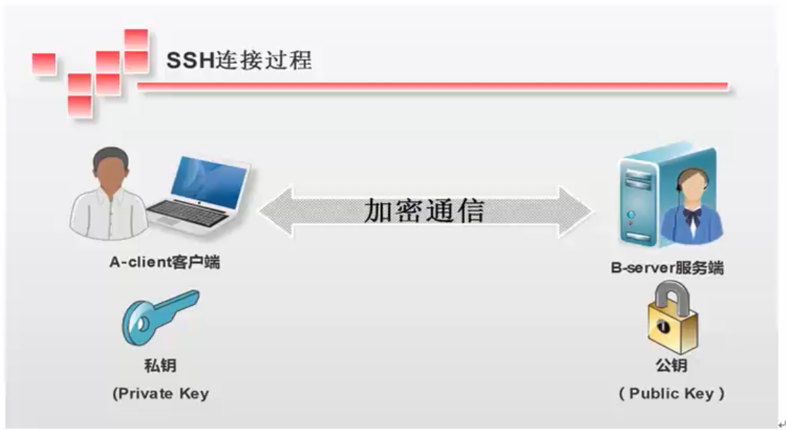

# SSH（安全外壳协议）

- SSH是Secure Shell Protocol的简写，由IETF网络工作小组（Network Working Group）制定：在进行数据传输之前，SSH先对联机数据包通过加密技术进行加密处理，加密后在进行数据传输。确保了传递的数据安全。
- SSH是专为远程登录会话和其他网络服务提供的安全性协议。利用SSH协议可以有效的防止远程管理过程中的信息泄露问题，在当前的生产环境运维工作中，绝大多数企业普通采用SSH协议服务来代替传统的不安全的远程联机服务软件，如telnet（23端口，非加密的）等。
- 在默认状态下，SSH服务主要提供两个服务功能：一个是提供类似telnet远程联机服务器的服务，即上面提到的SSH服务；另一个是类似FTP服务的sftp-server，借助SSH协议来传输数据的，提供更安全的SFTP服务（vsftp.proftp）
- SSH最初是UNIX系统上的一个程序，后来又迅速扩展到其他操作平台。SSH在正确使用时可弥补网络中的漏洞。SSH客户端适用于多种平台。几乎所有UNIX平台—包括[HP-UX](http://baike.baidu.com/view/58963.htm)、[Linux](http://baike.baidu.com/view/1634.htm)、[AIX](http://baike.baidu.com/view/349664.htm)、[Solaris](http://baike.baidu.com/subview/329359/5113665.htm)、[Digital](http://baike.baidu.com/view/428214.htm) [UNIX](http://baike.baidu.com/view/8095.htm)、[Irix](http://baike.baidu.com/view/3373083.htm)，以及其他平台，都可运行SSH。
- 最早的时候，互联网通信都是明文通信，一旦被截获，内容就暴露无疑。1995年，芬兰学者Tatu Ylonen设计了SSH协议，将登录信息全部加密，成为互联网安全的一个基本解决方案，迅速在全世界获得推广，目前已经成为Linux系统的标准配置。


- telnet是不安全的远程连接，连接内容是明文的；
- ssh是加密的远程连接，连接内容是加密的。


## SSH加密技术

**SSH 2.x的加密连接过程**

- 在SSH 1.x的联机过程中，当Server接受Client端的Private Key后，就不再针对该次联机的Key pair进行检验。此时若有恶意黑客针对该联机的Key pair对插入恶意的程序代码时，由于服务端你不会再检验联机的正确性，因此可能会接收该程序代码，从而造成系统被黑掉的问题。
- 为了改正这个缺点，SSH version 2 多加了一个确认联机正确性的Diffie-Hellman机制，在每次数据传输中，Server都会以该机制检查数据的来源是否正确，这样，可以避免联机过程中被插入恶意程序代码的问题。也就是说，SSH version 2 是比较安全的。
- 由于SSH1协议本身存在较大安全问题，因此，建议大家尽量都用SSH2的联机模式。而联机版本的设置则需要在SSH主机端与客户端均设置好才行。




对称和非对称加密算法主要采用公钥和私钥的形式，来对数据加密。

- DES(Data Encryption Standard，数据加密算法)
- PBE(Password-based encryption，基于密码验证)
- RSA(算法的名字以发明者的名字命名：Ron Rivest, AdiShamir 和Leonard Adleman)
- DH(Diffie-Hellman算法，密钥一致协议)
- DSA(Digital Signature Algorithm，数字签名)
- ECC(Elliptic Curves Cryptography，椭圆曲线密码编码学)


## SSH服务认证

从客户端来看，SSH提供两种级别的安全验证。

### 第一种级别（基于口令的安全验证）

- 只要你知道自己帐号和口令（当然也要知道对应服务器的IP及开放的SSH端口，默认为22），就可以登录到远程主机。所有传输的数据都会被加密，但是不能保证你正在连接的服务器就是你想连接的[服务器](http://baike.baidu.com/view/899.htm)。可能会有别的服务器在冒充真正的服务器，也就是受到“中间人”这种方式的攻击。

### 第二种级别（基于密匙的安全验证）

- 基于密钥的安全验证方式是指，需要依靠密钥，也就是必须事先建立一对密钥对，然后把公用密钥（Public key）放在需要访问的目标服务器上，另外，还需要把私有密钥（Private key）放到SSH的客户端或对应的客户端服务器上。
- 如果要想连接到这个带有公用密钥的SSH服务器，客户端SSH软件或客户端服务器就会向SSH服务器发出请求，请求用联机的用户密钥进行安全验证。SSH服务器收到请求之后，会先在该SSH服务器上连接的用户的家目录下寻找事先放上去的对应用户的公用密钥，然后把它和连接的SSH客户端发送过来的公用密钥进行比较。如果两个密钥一致，SSH服务器就用公用密钥加密“质询”（challenge）并把它发送给SSH客户端。
- SSH客户端收到“质询”之后就可以用自己的私钥解密，再把它发送给SSH服务器。使用这种方式，需要知道联机用户的密钥文件。与第一种基于口令验证的方式相比，第二种方式不需要在网络上传送口令密码，所以安全性更高了，这时我们也要注意保护我们的密钥文件，特别是私钥文件，一旦被黑客获取，危险就很大了。
- 第二种级别不仅加密所有传送的数据，而且“中间人”这种攻击方式也是不可能的（因为他没有你的私人密匙）。但是整个登录的过程可能需要10秒。
- 基于密钥的安全认证也有windows客户端和linux客户端的区别。


## 层次

SSH 主要由三部分组成：

- **传输层协议 [SSH-TRANS]**：提供了服务器认证，保密性及完整性。此外它有时还提供压缩功能。 SSH-TRANS 通常运行在[TCP/IP](http://baike.baidu.com/view/7729.htm)连接上，也可能用于其它可靠数据流上。 SSH-TRANS 提供了强力的加密技术、密码主机认证及完整性保护。该协议中的认证基于主机，并且该协议不执行[用户认证](http://baike.baidu.com/view/1223029.htm)。更高层的用户认证协议可以设计为在此协议之上。
- **用户认证协议 [SSH-USERAUTH]**：用于向服务器提供客户端用户鉴别功能。它运行在[传输层](http://baike.baidu.com/view/239605.htm)协议 SSH-TRANS 上面。当SSH-USERAUTH 开始后，它从低层协议那里接收会话[标识符](http://baike.baidu.com/view/390932.htm)（从第一次[密钥](http://baike.baidu.com/view/934.htm)交换中的交换[哈希](http://baike.baidu.com/view/99075.htm)H ）。会话标识符唯一标识此会话并且适用于标记以证明私钥的所有权。 SSH-USERAUTH 也需要知道低层协议是否提供保密性保护。
- **连接协议 [SSH-CONNECT]**：将多个加密隧道分成逻辑通道。它运行在用户认证协议上。它提供了交互式登录话路、远程命令执行、转发 TCP/IP 连接和转发 X11 连接。

## 结构

SSH是由客户端和[服务端](http://baike.baidu.com/view/1087294.htm)的软件组成的，有两个不兼容的版本分别是：1.x和2.x。 用SSH 2.x的客户程序是不能连接到SSH 1.x的服务程序上去的。OpenSSH 2.x同时支持SSH 1.x和2.x。

服务端是一个[守护进程](http://baike.baidu.com/view/53123.htm)(daemon)，他在后台运行并响应来自客户端的连接请求。服务端一般是sshd进程，提供了对远程连接的处理，一般包括公共密钥认证、密钥交换、[对称密钥](http://baike.baidu.com/view/1145164.htm)加密和非安全连接。

客户端包含ssh程序以及像[scp](http://baike.baidu.com/view/18809.htm)（远程拷贝）、slogin（远程登陆）、[sftp](http://baike.baidu.com/view/65352.htm)（安全文件传输）等其他的应用程序。

他们的工作机制大致是本地的客户端发送一个连接请求到远程的服务端，服务端检查申请的包和IP地址再发送密钥给SSH的客户端，本地再将密钥发回给服务端，自此连接建立。SSH 1.x和SSH 2.x在连接协议上有一些差异。

一旦建立一个安全传输层连接，客户机就发送一个服务请求。当用户认证完成之后，会发送第二个服务请求。这样就允许新定义的协议可以与上述协议共存。连接协议提供了用途广泛的各种通道，有标准的方法用于建立安全交互式会话外壳和转发（“[隧道技术](http://baike.baidu.com/view/626368.htm)”）专有 TCP/IP 端口和 X11 连接。

SSH被设计成为工作于自己的基础之上而不利用超级服务器([inetd](http://baike.baidu.com/view/500836.htm))，虽然可以通过inetd上的[tcpd](http://baike.baidu.com/view/500873.htm)来运行SSH进程，但是这完全没有必要。启动SSH服务器后，sshd运行起来并在默认的22端口进行监听（你可以用 # ps -waux | grep sshd 来查看sshd是否已经被正确的运行了）如果不是通过inetd启动的SSH，那么SSH就将一直等待连接请求。当请求到来的时候SSH守护进程会产生一个子进程，该子进程进行这次的连接处理。

## 扩展

SSH协议框架中设计了大量可扩展的冗余能力，比如用户自定义算法、客户自定义密钥规则、高层扩展功能性应用协议。这些扩展大多遵循 IANA 的有关规定，特别是在重要的部分，像命名规则和消息编码方面。

SSH采用面向连接的[TCP](http://baike.baidu.com/view/32754.htm)协议传输，应用22号端口，安全系数较高。

# OpenSSH

OpenSSH 是 [SSH](http://baike.baidu.com/view/16184.htm) （Secure [SHell](http://baike.baidu.com/view/849.htm)） 协议的免费开源实现。SSH协议族可以用来进行远程控制， 或在计算机之间传送文件。而实现此功能的传统方式，如telnet([终端仿真](http://baike.baidu.com/view/190233.htm)协议)、 rcp ftp、 rlogin、rsh都是极为不安全的，并且会使用明文传送密码。OpenSSH提供了服务端后台程序和客户端工具，用来加密远程控件和文件传输过程中的数据，并由此来代替原来的类似服务。

OpenSSH是使用SSH透过计算机网络加密通讯的实现。它是取代由SSH Communications Security所提供的商用版本的开放源代码方案。目前OpenSSH是OpenBSD的子计划。

OpenSSH常常被误认以为与OpenSSL有关联，但实际上这两个计划的有不同的目的，不同的发展团队，名称相近只是因为两者有同样的软件发展目标──提供开放源代码的加密通讯软件。

OpenSSH is the premier connectivity tool for remote login with the SSH protocol. It encrypts all traffic to eliminate eavesdropping, connection hijacking, and other attacks. In addition, OpenSSH provides a large suite of secure tunneling capabilities, several authentication methods, and sophisticated configuration options.
The OpenSSH suite consists of the following tools:

- Remote operations are done using [ssh](http://man.openbsd.org/?query=ssh&sektion=1), [scp](http://man.openbsd.org/?query=scp&sektion=1), and [sftp](http://man.openbsd.org/?query=sftp&sektion=1).

- Key management with [ssh-add](http://man.openbsd.org/?query=ssh-add&sektion=1), [ssh-keysign](http://man.openbsd.org/?query=ssh-keysign&sektion=8), [ssh-keyscan](http://man.openbsd.org/?query=ssh-keyscan&sektion=1), and [ssh-keygen](http://man.openbsd.org/?query=ssh-keygen&sektion=1).
- The service side consists of [sshd](http://man.openbsd.org/?query=sshd&sektion=8), [sftp-server](http://man.openbsd.org/?query=sftp-server&sektion=8), and [ssh-agent](http://man.openbsd.org/?query=ssh-agent&sektion=1).

OpenSSH is developed by a few developers of the [OpenBSD Project](https://www.openbsd.org/) and made available under a BSD-style license.
OpenSSH is incorporated into many commercial products, but very few of those companies assist OpenSSH with funding.
Contributions towards OpenSSH can be sent to the [OpenBSD Foundation](https://www.openbsd.org/donations.html).

## 服务

OpenSSH服务，sshd，是一个典型的独立[守护进程](http://baike.baidu.com/view/53123.htm)(standalone daemon)，但也可以根据需要通过网络守护进程(Internet Daemon)-inetd或Ineternet Daemon's more modern-xinted加载。OpenSSH服务可以通过/etc/ssh/sshd_config文件进行配置。

## 版本介绍

OpenSSH 支持 SSH 协议的版本 1.3、1.5、和 2。自从 OpenSSH 的版本2.9以来，默认的协议是版本2，该协议默认使用 RSA 钥匙。

# SSH应用

## SSH客户端

```shell
# 使用密码登录，每次都必须输入密码，非常麻烦。
# SSH还提供了公钥登录，可以省去输入密码的步骤。
# 生成所有的ssh公钥和私钥文件到/etc/ssh目录下 
# 	ssh_host_rsa_key ssh_host_rsa_key.pub ...
$ ssh-keygen -A 
ssh-keygen: generating new host keys: RSA DSA ECDSA ED25519
# 生成ssh key +三回车，生成'$HOME/.ssh/id_rsa'私钥与'$HOME/.ssh/id_rsa.pub'公钥
$ ssh-keygen
# 1）创建密钥对时，要你输入的密码，为进行密钥对验证时输入的密码（和linux角色登录的密码完全没有关系）；
# 2）如果我们要进行的是SSH免密码连接，那么这里密码为空跳过即可。
# 3）如果在这里你输入了密码，那么进行SSH密钥对匹配连接的时候，就需要输入这个密码了。（此密码为独立密码）

# 非交互式一条命令创建密钥对
$ ssh-keygen -P "" -t rsa -f ~/.ssh/id_rsa
#	-t：指定加密类型（rsa，dsa）
#	-f：指定密钥对文件的名字
#	-P（大写）：指定密码

# 将公钥传送到远程主机host上面：
# 自动将公钥复制到目标主机$HOME/.ssh/authorized_keys文件中
$ ssh-copy-id -i $HOME/.ssh/id_rsa.pub user@host
$ scp $HOME/.ssh/id_rsa.pub user@host:~/.ssh/
# 在服务端机器上执行
$ cat $HOME/.ssh/id_rsa.pub >> ~/.ssh/authorized_keys 

# 删除已经认证过的主机用于访问容器内的主机
$ rm ~/.ssh/known_hosts
# SSH主要用于远程登录。用户名user，远程主机host
$ ssh user@host
# 如果本地用户名与远程用户名一致，登录时可以省略用户名。
$ ssh host
# SSH的默认端口是22。使用p参数，可以修改这个端口。
$ ssh -p 2222 user@host

# 第一次进行远程登录，ssh会试图把远程主机的IP信息存储到～/.known_hosts文件里，所以，会问你yes或no。
# 采用-o StrictHostKeyChecking=no可以免交互
$ ssh -p 2222 -o StrictHostKeyChecking=no root@127.0.0.1

# sshpass 可以通过参数输入密码，实现完全免交互
$ sshpass -p 登录密码 ssh -p 2222 -o StrictHostKeyChecking=no root@nfs01
# 生成密钥对
$ ssh-keygen -t dsa -P "" -f ~/.ssh/id_dsa
# 免交互分发公钥
$ sshpass -p 密码 ssh-copy-id -i ~/.ssh/id_dsa.pub "-o StrictHostKeyChecking=no 172.16.1.31"
# 验证公钥发送结果
$ ssh root@172.16.1.31

# 当远程主机的公钥被接受以后，它就会被保存在文件$HOME/.ssh/known_hosts之中。

# 远程主机将用户的公钥，保存在登录后的用户主目录的$HOME/.ssh/authorized_keys文件中。
$ ssh user@host 'mkdir -p .ssh && cat >> .ssh/authorized_keys' < ~/.ssh/id_rsa.pub

# Client端配置文件
$ cat /etc/ssh/ssh_config
# Server端配置文件
$ cat /etc/ssh/sshd_config
# Server端服务脚本
$ cat /etc/init.d/sshd
# $ cat /etc/sysconfig/sshd

# 客户端命令
/usr/bin/scp			# 远程复制文件
/usr/bin/sftp        	# 远程文件共享
/usr/bin/slogin			#
/usr/bin/ssh			#
/usr/bin/ssh-add		#
/usr/bin/ssh-agent		#
/usr/bin/ssh-copy-id	# 拷贝公钥
/usr/bin/ssh-keygen		# 秘钥公钥生成工具
/usr/bin/ssh-keyscan	#

# ssh的基本用法如下：
# ssh [OPTIONS] [user]@server [COMMAND]
#	-l user：以指定用户身份连接至服务器；默认使用本地用户为远程登录时的用户
#	-p PORT：指明要连接的端口
#	-X：启用X11Forwarding，即转发X界面的请求
#	-x： 禁用
#	-Y:  启用信任的X11Forwarding
```

ssh 配置文件的详细解释：

1. `HostName` - 定义真正要登录的主机名，此外，你也可以使用数字 IP 地址，不管是在命令行或是 HostName 定义中都允许使用其中任一种。
2. `User` – 指定以哪一个用户来登录。
3. `Port` – 设置连接远程主机的端口，默认是 22 端口。但必须是远程主机的 sshd 配置文件中定义的端口号。
4. `Protocol` – 这个选项定义了优先使用 ssh 支持的协议版本。常用的值为 ‘1’ 和 ‘2’，同时使用两个协议版本则必须使用英文逗号隔开。
5. `IdentityFile` – 指定一个用于读取用户 DSA、Ed25519、ECDSA 等授权验证信息的文件。
6. `ForwardX11` – 定义 X11 连接是否自动重定向到安全通道和 DISPLAY 设置。有两个可以设置的值，即 `yes` 或 `no`。
7. `Compression` – 默认值为 `no`，如果设置为 `yes`，则在连接远程主机过程中使用压缩进行传输。
8. `ServerAliveInterval` – 设置当没有收到服务器响应 （或者数据)）时的超时时间，单位为秒，ssh 会通过加密信道发送信息，请求服务器响应。默认值为 `0`，这意味着 ssh 不会向服务器发送响应请求；如果定义了 BatchMode 选项，则默认是 300 秒。
9. `ServerAliveCountMax` – 设置服务器在没有接收到服务器的任何响应时，由服务器发送的活动信息数量。
10. `LogLevel` – 定义 ssh 登录信息的的日志冗余级别。允许的值为：`QUIET`、`FATAL`、`ERROR`、`INFO`、`VERBOSE`、`DEBUG`、`DEBUG1`、`DEBUG2`和 `DEBUG3`，默认为 `INFO`。


## SCP远程复制工具

- scp是加密的远程拷贝，而cp仅为本地拷贝
- 可以把数据从一台机器推送到另一台机器，也可以从其他服务器把数据拉回到本地执行命令的服务器
- 每次都是全量完整拷贝，因此，效率不高，适合第一次拷贝用，如果需要增量拷贝，用rsync

```shell
# scp远程复制工具的使用简介
# scp [OPTIONS] SRC...DEST
#	-r: 递归复制，复制目录及内部文件时使用；
#	-p: 保存源文件元数据信息中的属主、属组及权限；
#	-q: 静默模式
#	-P PORT: 指明远程服务器使用的端口；
-1 强制scp使用ssh1 协议。
-2 强势scp使用ssh2 协议。
-4 强制scp使用 IPV4格式地址。
-6 强制scp使用IPV6格式地址。
-B 使用批处理模式（传输之前不再询问密码或者口令）。
-C 启用压缩模式，将-C传递给ssh协议，从而打开压缩功能。
-p 保留源文件的修改时间、访问时间还有访问权限。
-q 禁用传输进度条。-r 递归拷贝指定的整个文件夹。
-c cipher    选择cipher方式来加密传输的数据，该选项将直接传递给ssh使用。
-F ssh_config   指定一个可用来替代ssh的配置文件，该选项直接传递给ssh使用。
-i identity_file   从指定的文件中读取用于RSA 验证的密钥，该选项直接传递给ssh使用。
-l limit   限定用户可以使用的宽带，以Kbit/s为速度单位。
-P port   这里的P是大写。指定连接远程主机用的端口。
-S program   指定加密传输连接时使用的加密程序。
-o ssh_option   使用在ssh_config(5)所用的格式将参数传递给ssh。
# 复制本地文件至远程主机 （但远程目录一定要有写权限）
# PUSH: scp [OPTIONS] /PATH/FROM/SOMEFILE ... user@server:/PATH/TO/DEST 
# 复制远程目标主机文件至本地 
# PULL: scp [OPTIONS] user@server:/PATH/FROM/SOMEFILE /PATH/TO/DEST
# 从容器中拷贝出配置文件
$ scp -P 2222 root@127.0.0.1:/etc/ssh/sshd_config ./
```

## SFTP

SFTP 是一种通过 SSH 协议提供文件访问、文件传输和文件管理功能的安全文件传输协议。因为 SSH 在网络中从一台电脑到另一台电脑传输文件的时候使用数据加密通道，并且 SSHFS 内置在 FUSE（用户空间的文件系统）内核模块，允许任何非特权用户在不修改内核代码的情况下创建他们自己的文件系统。

```shell
# sftp的使用
# 要使用sftp需要编辑/etc/ssh/sshd_config 开启Subsystem 即：
# Subsystem       sftp    /usr/libexec/openssh/sftp-server  
# sftp [USER]@server
# put get
$ sftp -P 2222 root@127.0.0.1
$ sftp> get /etc/ssh/sshd_config ./
```

## SSHFS

SSHFS（Secure SHell FileSystem）是一个客户端，可以让我们通过 SSH 文件传输协议（SFTP）挂载远程的文件系统并且在本地机器上和远程的目录和文件进行交互。

当你安装 SSHFS 包之后，你需要创建一个挂载点目录，在这儿你将要挂载你的远程文件系统。

```shell
$ mkdir -p /mnt/bolik
$ sshfs tecmint@x.x.x.x:/home/bolik/ /mnt/bolik
```

## rsync

Andrew Tridgell 和 Paul Mackerras 编写了 rsync ，首次发布于 1996 年。它的目标是向另一台电脑同步文件。你注意到了他们为什么取这个名字了吗（remotely synchronize）？它是大多数发行版都提供的开源软件。

rsync 能够用于同步两个目录或目录树，无论它们是在同一个计算机上还是不同的计算机上，而且不仅如此，它还能做到更多。它创建或者更新的目录与源目录完全一样。新的目录不是以 tar 或 zip 等打包存储，而是普通的目录和文件，常见的 Linux 工具都能轻松访问，而这正是我所需要的。

rsync 的最重要的特性之一是它处理源目录被修改的已有文件的方式。它使用分块校验来比较源文件和目标文件，而不是从源把整个文件复制过去。如果两个文件所有块的校验和都相同，那么就不用传输数据。否则只有被改变的块被传输。这样节约了远程同步消耗的大量时间和带宽。比如，我第一次使用 rsync 脚本来把我所有的主机备份到一个外接的大型 usb 硬盘上需要三个小时，因为所有的数据都需要传输过去。而接下来的备份需要的时间就只是 3 到 8 分钟，这取决于上次备份以来创建和改变了多少文件。我使用 `time`命令来记录实际花费的时间。昨天晚上，我只花了三分钟来从六个远程系统和本地工作站备份大概 750 Gb 数据。实际上只有在白天改变的几百 Mb 数据需要备份。

下面的命令可以用来同步两个目录及其任意子目录的内容。也就是说，在新目录的内容和源目录同步完之后，它们的内容完全一样。

```shell
$ rsync -aH sourcedir targetdir      
$ rsync -aH -e ssh --delete --exclude Cache --link-dest=yesterdaystargetdir remote1:sourcedir todaystargetdir
-a 选项表示归档模式，它会保持权限、所有关系和符号（软）链接。
-H 选项用来保持硬链接。注意源目录和目标目录都可以在远程主机上。
--link-dest 使每日备份只花费很少的额外空间和很短的时间。
--exclude 选项。用这个选项加上你想排除文件或目录的模式。你可以用下面的新命令来排除浏览器的缓存。
```

用这个选项指定前一天的备份目录，以及今天的备份目录，然后 rsync 会创建今天的新备份目录，并将昨天备份目录里的每一个文件在今天的备份目录中创建硬链接。现在我们在今天的备份目录中有一大堆指向昨天备份的硬链接。文件没有被重复创建，而是创建了一些硬链接。对于[硬链接](undefined)[3]，在 Wikipedia 中有非常详细的描述。而在用昨天的备份目录文件的硬链接创建了今天的备份之后，rsync 和平常一样进行备份，如果在文件中检测到了变化，就不会做硬链接，而是从昨天的备份目录里复制一个文件的副本，再把源文件中变化的部分复制过去。（LCTT 译注：此处疑似原文表述不清，参见 `generator.c` 的 `try_dests_reg` 函数，先根据 `match_level` 选择复制或者硬链接，而不是创建硬链接后再判断 `match_level`）

## screen

screen 是一个非常有用的命令，提供从单个 SSH 会话中使用多个 shell 窗口（会话）的能力。当会话被分离或网络中断时，screen 会话中启动的进程仍将运行，你可以随时重新连接到 screen 会话。如果你想运行一个持久的进程或者从多个位置连接到 shell 会话，这也很方便。

- 你可以在命令行中输入 `screen` 来启动它，接着会有一个看上去和命令行提示符一样的 `screen` 会话启动。
- 使用描述性名称启动屏幕会话是一个很好的做法，这样你可以轻松地记住会话中正在运行的进程。要使用会话名称创建新会话，请运行以下命令：`screen -S name`
- 要从当前的 screen 会话中分离，你可以按下 `Ctrl-A` 和 `d`。所有的 screen 会话仍将是活跃的，你之后可以随时重新连接。
- 如果你从一个会话分离，或者由于某些原因你的连接被中断了，重新连接：`screen -r -S name`
- 如果你有多个 screen 会话，你可以用 `screen -ls` 参数列出它们。
- 有几种方法来中止 screen 会话。你可以按下 `Ctrl+d`，或者在命令行中使用 `exit` 命令。

## rtop

rtop 是一个基于 SSH 的直接的交互式远程系统监控工具，它收集并显示重要的系统性能指标，如 CPU、磁盘、内存和网络指标。它用 Go 语言编写，不需要在要监视的服务器上安装任何额外的程序，除了 SSH 服务器和登录凭据。rtop 基本上是通过启动 SSH 会话和在远程服务器上执行某些命令来收集各种系统性能信息。一旦 SSH 会话建立，它每隔几秒（默认情况下为 5 秒）刷新来自远程服务器收集的信息，类似于 Linux 中的所有其它类似 top 的使用程序（如 htop）。

如果你已经安装了 Go，运行下面的命令构建 rtop：`$ go get github.com/rapidloop/rtop`


## PuTTY

**PuTTY 是一套免费的 SSH / Telnet 程序，**它可以连接上支持 SSH Telnet 协议的站点，并且可自动取得对方的系统指纹码 (Fingerprint)。建立联机以后，所有的通讯内容都是以加密的方式传输，因此你再也不用害怕使用 Telnet 在 Internet 或公司的内部网络传输资料时被他人获知内容了。


---