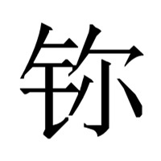
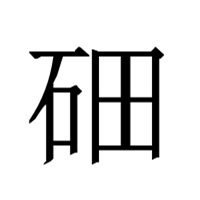
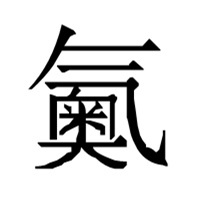

# 化学元素周期表

现代化学的元素周期律是1869年俄国科学家门捷列夫(Dmitri Mendeleev)首创的，他将当时已知的63种元素依原子量大小并以表的形式排列，把有相似化学性质的元素放在同一行，就是元素周期表的雏形。利用周期表，门捷列夫成功的预测当时尚未发现的元素的特性(镓、钪、锗)。1913年英国科学家莫色勒利用阴极射线撞击金属产生X射线，发现原子序越大，X射线的频率就越高，因此他认为核的正电荷决定了元素的化学性质，并把元素依照核内正电荷(即质子数或原子序)排列，经过多年修订后才成为当代的周期表。

在周期表中，元素是以元素的原子序排列，最小的排行最先。表中一横行称为一个周期，一列称为一个族。

## 化学元素周期表

| 周期   | IA              |                |                 |                |                 |                 |                 |                 |                 |                |                 |                  |                                   |                |                    |                |                                 |                             |
| ---- | --------------- | -------------- | --------------- | -------------- | --------------- | --------------- | --------------- | --------------- | --------------- | -------------- | --------------- | ---------------- | --------------------------------- | -------------- | ------------------ | -------------- | ------------------------------- | --------------------------- |
| 1    | 1 H 氢 1.0079    | IIA            |                 |                |                 |                 |                 |                 |                 |                |                 |                  | IIIA                              | IVA            | VA                 | VIA            | VIIA                            | 2 He 氦  4.0026              |
| 2    | 3 Li 锂 6.941    | 4 Be 铍 9.0122  |                 |                |                 |                 |                 |                 |                 |                |                 |                  | 5 B 硼 10.811                      | 6 C 碳 12.011   | 7 N 氮 14.007       | 8 O 氧 15.999   | 9 F 氟 18.998                    | 10 Ne 氖 20.1797             |
| 3    | 11 Na 钠 22.9898 | 12 Mg 镁 24.305 | IIIB            | IVB            | VB              | VIB             | VIIB            |                 | VIII            |                | IB              | IIB              | 13 Al 铝 26.982                    | 14 Si 硅 28.085 | 15 P 磷 30.974      | 16 S 硫 32.06   | 17 Cl 氯 35.453                  | 18 Ar 氩 39.948              |
| 4    | 19 K 钾 39.098   | 20 Ca 钙 40.08  | 21 Sc 钪 44.956  | 22 Ti 钛 47.9   | 23 V 钒 50.9415  | 24 Cr 铬 51.996  | 25 Mn 锰 54.938  | 26 Fe 铁 55.84   | 27 Co 钴 58.9332 | 28 Ni 镍 58.69  | 29 Cu 铜 63.54   | 30 Zn 锌 65.38    | 31 Ga 镓 69.72                     | 32 Ge 锗 72.59  | 33 As 砷 74.9216    | 34 Se 硒 78.9   | 35 Br 溴 79.904                  | 36  Kr  氪 83.80             |
| 5    | 37 Rb 铷 85.467  | 38 Sr 锶 87.62  | 39 Y 钇 88.906   | 40 Zr 锆 91.22  | 41 Nb 铌 92.9064 | 42 Mo 钼 95.94   | 43 Tc 锝 99      | 44 Ru 钌 101.07  | 45 Rh 铑 102.906 | 46 Pd 钯 106.42 | 47 Ag 银 107.868 | 48 Cd 镉 112.41   | 49 In 铟 114.82                    | 50 Sn 锡 118.6  | 51 Sb 锑 121.7      | 52 Te 碲 127.6  | 53 I 碘 126.905                  | 54 Xe 氙 131.29              |
| 6    | 55 Cs 铯 132.905 | 56 Ba 钡 137.33 | 57-71 La-Lu 镧系  | 72 Hf 铪 178.4  | 73 Ta 钽 180.947 | 74 W 钨 183.8    | 75 Re 铼 186.207 | 76 Os 锇 190.2   | 77 Ir 铱 192.2   | 78 Pt 铂 195.08 | 79 Au 金 196.967 | 80 Hg 汞 200.5    | 81 Tl 铊 204.3                     | 82 Pb 铅 207.2  | 83 Bi 铋 208.98     | 84 Po 钋 (209)  | 85 At 砹 (210)                   | 86 Rn 氡 222.0176            |
| 7    | 87 Fr 钫 (223)   | 88 Ra 镭 226.03 | 89-103 Ac-Lr 锕系 | 104 Rf 鑪 (261) | 105 Db 𨧀(262)  | 106 Sg 𨭎 (266) | 107 Bh 𨨏 (264) | 108 Hs 𨭆 (269) | 109 Mt 䥑 (268)  | 110 Ds 鐽 (271) | 111 Rg 錀 (272)  | 112 Cn Uub (285) | 113 Uut  （nǐ）(284) | 114 Uuq (289)  | 115 Uup 镆（mò）(288) | 116 Uuh (292)  | 117 Uus （tián） | 118 Uuo （ào） |
|      |                 | 镧系             | 57 La 镧 138.905 | 58 Ce 铈 140.12 | 59 Pr 镨 140.91  | 60 Nd 钕 144.2   | 61 Pm 钷 147     | 62 Sm 钐 150.4   | 63 Eu 铕 151.96  | 64 Gd 钆 157.25 | 65 Tb 铽 158.93  | 66 Dy 镝 162.5    | 67 Ho 钬 164.93                    | 68 Er 铒 167.2  | 69 Tm 铥 168.934    | 70 Yb 镱 173.0  | 71 Lu 镥 174.96                  |                             |
|      |                 | 锕系             | 89 Ac 锕 (227)   | 90 Th 钍 232.03 | 91 Pa 镤 231.03  | 92 U 铀 238.02   | 93 Np 镎 237.04  | 94 Pu 钚 (244)   | 95 Am 镅 (243)   | 96 Cm 锔 (247)  | 97 Bk 锫 (247)   | 98 Cf 锎 (251)    | 99 Es 锿 (254)                     | 100 Fm 镄 (257) | 101 Md 钔 (258)     | 102 No 锘 (259) | 103 Lr 铹 (260)                  |                             |

## 1. H 氢

- 元素名称：氢
- 元素符号： H
- 英文名称：Hydrogen
- 原子序数：1
- 相对原子质量($^{12}C$ = 12.0000)：1.00797
### 原子结构

- 原子半径（Å）：0.79
- 共价半径（Å）：0.32
- 离子半径（Å）：0.012
- 原子体积（$cm^3/mol$）：14.4
- 电子构型：$1s^1$
- 氧化态: $I$
### 电子模型

### 发现
1766年, 在英国伦敦，由 H. Cavendish 发现。
### 来源
在宇宙中最丰富的元素，主要和氧结合，以水的形式存在与自然界，也存在于矿井、油和汽井之中。
### 用途
用于生产氨、乙醇、氯化氢、溴化氢、植物油和不饱和烃的氢化，火箭燃料，低温学研究等。有两个同位素：氘（D）和氚（T）。
### 物理性质
- 状态：无味、无色、无臭、极易燃烧的气体。
- 熔点（℃）： -258.975
- 沸点（℃）： -252.732
- 密度（g/L/273K,1atm）：0.0899
- 自燃点（℃）：500
- 比热（$J/(g \cdot K)$）：14.304
- 蒸发热（$KJ/mol$）：0.44936
- 熔化热（$KJ/mol$）：0.05868
- 闪点（℃）：253
- 导电率：－－
- 导热系数：0.001815 
### 化学性质

### 地质数据
- 丰度：
- 滞留时间（年）：
- 太阳(相对于 H=1×1012)：最丰富的元素
- 海水中（$p.p.m.$）：作为水的成分存在于海水中，也有一些气体$H_2$溶在其中。
- 地壳（$p.p.m.$）：1520       
- 大气（$p.p.m.$体积）：0.5
### 生物数据

人体中含量
- 肝（$p.p.m.$）：93000
- 肌肉（$p.p.m.$）：93000
- 血（$mg dm^{-3}$）：以水存在于血液中
- 日摄入量: 
- 骨（$p.p.m.$）：52000
- 人均体内总量（70Kg）：7kg

氢是元素周期表中的第一号元素，元素名来源于希腊文，原意是“水素”。氢是由英国化学家卡文迪许在1766年发现，称之为可燃空气，并证明它在空气中燃烧生成水。1787年法国化学家拉瓦锡证明氢是一种单质并命名。氢在地壳中的丰度很高，按原子组成占15.4%，但重量仅占1%。在宇宙中，氢是最丰富的元素。在地球上氢主要以化和态存在于水和有机物中。有三种同位素：氕、氘、氚。

氢在通常条件下为无色、无味的气体；气体分子由双原子组成；熔点-259.14°C，沸点-252.8°C，临界温度33.19K，临界压力12.98大气压，气体密度0.0899克/升；水溶解度21.4厘米³/千克水（0°C），稍溶于有机溶剂。

在常温下，氢比较不活泼，但可用合适的催化剂使之活化。在高温下，氢是高度活泼的。除稀有气体元素外，几乎所有的元素都能与氢生成化合物。非金属元素的氢化物通常称为某化氢，如卤化氢、硫化氢等；金属元素的氢化物称为金属氢化物，如氢化锂、氢化钙等。

氢是重要的工业原料，又是未来的能源。

## 参考资料

- [化学元素周期表](http://www.zdic.net/appendix/f7.htm)
- [动图化学元素周期表](http://elements.wlonk.com/ElementsTable.htm)
- [中科院等公布4个新元素中文名](http://news.sciencenet.cn/htmlnews/2017/5/375810.shtm)