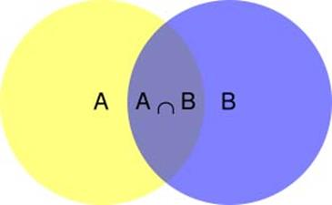

# 贝叶斯定理（[Bayes' theorem](http://en.wikipedia.org/wiki/Bayes%27_theorem)）

**贝叶斯法则**又被称为**贝叶斯定理、贝叶斯规则**是概率统计中的应用所观察到的现象对有关[概率分布](http://wiki.mbalib.com/wiki/%E6%A6%82%E7%8E%87%E5%88%86%E5%B8%83)的主观判断（即[先验概率](http://wiki.mbalib.com/wiki/%E5%85%88%E9%AA%8C%E6%A6%82%E7%8E%87)）进行修正的标准方法。

通常，事件 $A$ 在事件 $B$ (发生)的条件下的概率，与事件 $B$ 在事件 $A$ 的条件下的概率是不一样的；然而，这两者是有确定的关系，贝叶斯法则就是这种关系的陈述。

$\displaystyle P(A \mid B) = \frac {P(B \mid A) \cdot P(A)} {P(B)}$

## 通俗理解

在本质上，贝叶斯意味着概率。这个具体的术语存在是因为有两个概率方法。贝叶斯认为这是一个衡量的信念，因此，概率是主观的，并且指向未来。

频率论者有不同看法：他们用概率描述过去发生的事件——这种方式是客观的并且不取决于一个人的信念。这个名字来源于一个方法——例如：我们掷硬币100次，它出现头53次，所以频率/概率为0.53。

我们从一种信念开始，叫做先验。然后，我们获得了一些数据，并且用它来更新我们的信念。这个结果被称为后验概率。如果我们获得更多的数据，旧的后验成为一个新的先验并且循环重复。

这个过程采用贝叶斯规则：$\displaystyle P(A \mid B) = P(A) \frac {P(B \mid A)} {P(B)}$

$P(A \mid B)​$：读作给定 $B​$ 事件的 $A​$ 的概率，表示一个条件概率，即：如果 $B​$ 发生了，$A​$ 有多少可能会发生。

## 定理推导

条件概率（Conditional probability）指在事件 $B$ 发生的情况下，事件 $A$ 发生的概率，用 $P(A \mid B)$ 来表示。

根据文氏图，可以很清楚地看到在事件$B$发生的情况下，事件A发生的概率就是 $P(A \cap B)$ 除以 $P(B)$ 。即：$\displaystyle P(A \mid B) = \frac {P(A \cap B)} {P(B)}$ 。

因此，$\displaystyle P(A \cap B) = {P(A \mid B)} \cdot {P(B)}$ ；

同理可得，$\displaystyle P(B \cap A) = {P(B \mid A)} \cdot {P(A)}$ 。

由此可得**条件概率公式**：$\displaystyle P(A \cap B) = P(B \cap A) =  {P(A \mid B)} \cdot {P(B)} = {P(B \mid A)} \cdot {P(A)}$

即：事件 $A$ 和事件 $B$ 同时发生的概率等于在发生 $A$ 的条件下 $B$ 发生的概率乘以 $A$ 的概率；也等于在发生 $B$ 的条件下 $A$ 发生的概率乘以 $B$ 的概率。

由此可得**贝叶斯公式**：$\displaystyle P(A \mid B) = \frac {P(B \mid A) \cdot P(A)} {P(B)}$ 。

假定定样本空间 $S$ ，是两个事件 $A$ 与 $A^\prime$ 的和，即 $S = A + A^\prime$ 。

在这种情况下，在样本空间 $S$ 中发生事件 $B$ 可以划分成两个部分。

即：$P(B) = P(B \cap A) + P(B \cap A^\prime)$ 。

由条件概率我们已知 $P(B \cap A) = {P(B \mid A)} \cdot {P(A)} $ ，$P(B \cap A^\prime) = {P(B \mid A^\prime)} \cdot {P(A^\prime)}$；

所以可得**全概率公式**：$P(B) = {P(B \mid A)} \cdot {P(A)} + {P(B \mid A^\prime)} \cdot {P(A^\prime)}$ 。

它的含义是，如果 $A$ 和 $A^\prime$ 构成样本空间的一个划分，那么事件 $B$ 的概率，就等于 $A$ 和 $A^\prime$ 的概率分别乘以 $B$ 对这两个事件的条件概率之和。

将这个公式代入条件概率公式，就得到了**条件概率的另一种写法**：

$\displaystyle P(A \mid B) = \frac {P(B \mid A) \cdot P(A)} { {P(B \mid A)} \cdot {P(A)} + {P(B \mid A^\prime)} \cdot {P(A^\prime)}}$ 

## 贝叶斯推断的含义

对贝叶斯公式进行变形，可以得到如下形式：

$\displaystyle P(A \mid B) = P(A) {\frac {P(B \mid A)} {P(B)}}$

- $P(A)$称为$A$的"**先验概率**"（Prior probability），即在 $B$ 事件发生之前（不考虑任何 $B$ 方面的因素），我们对 $A$ 事件概率的一个判断。
- $P(A \mid B)$称为$A$的"**后验概率**"（Posterior probability），即在 $B$ 事件发生之后，我们对 $A$ 事件概率的重新评估。
- $P(B \mid A)/P(B)$称为"**可能性函数**"（Likelyhood），这是一个调整因子，使得预估概率更接近真实概率。

所以，条件概率可以理解成下面的式子：

$\displaystyle 后验概率 = 先验概率 \times 调整因子$

这就是贝叶斯推断的含义。我们先预估一个"**先验概率**"，然后加入实验结果，看这个实验到底是增强还是削弱了"**先验概率**"，由此得到更接近事实的"**后验概率**"。

在这里，如果"**可能性函数**" $P(B \mid A)/P(B) > 1$，意味着"**先验概率**"被增强，事件 $A$ 的发生的可能性变大；如果"**可能性函数**" $P(B \mid A)/P(B) = 1$，意味着 $B$ 事件无助于判断事件 $A$ 的可能性；如果"**可能性函数**" $P(B \mid A)/P(B) < 1$，意味着"**先验概率**"被削弱，事件 $A$ 的可能性变小。

## 贝叶斯定理的应用

贝叶斯方法自1763年提出以来，已有250多年的历史，在人工智能、机器学习的众多领域得到了广泛应用和发展。2011年的图灵奖获得者Judea Pearl教授的主要贡献是将概率统计引入人工智能，成为现代人工智能的理论基础。但是，在大数据环境下，贝叶斯学习面临着多方面的挑战。

近年来，贝叶斯方法在机器学习领域得到了快速发展。在基础理论方面，正则化贝叶斯方法通过变分和信息论工具，在优化框架下引用后验正则化项，扩展了贝叶斯方法在考虑问题属性和领域知识的灵活性；同时，非参数化贝叶斯方法也得到了快速发展。在算法方面，随机梯度的变分推理和蒙特卡洛采样算法被提出，通过随机采样在单机上能有效处理大规模数据集；同时，为了提高可扩展性，分布式的变分推理和蒙特卡洛算法也得到了重视和发展。在系统实现方面，贝叶斯方法已经在多种分布式计算框架下实现，包括：MapReduce/Spark，参数服务器，图计算（GraphLab）以及STRADS模型并行等。

最后，贝叶斯方法与深度学习具有互补的优势，前者在不确定性推理与决策、小样本学习方面具有独特优势；后者在表示学习、感知预测方面更灵活有效。二者的有机融合是未来的重要发展趋势。另外，发展更加友好的平台支持贝叶斯方法、深度学习以及二者的融合是另外一个重要趋势。

---