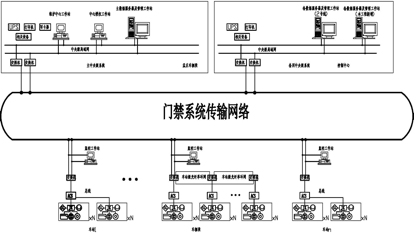

# 门禁系统构成

##  门禁系统构成原则

门禁系统按照==两级管理、三级控制==的原则进行设置。ACS的车站级和就地级负责就地数据的采集、转换、本地存储及上传。中央级ACS对各个车站及车辆段、区间变电所ACS进行监控。

本工程在车辆段和控制中心建设本工程中央级系统，车站级ACS接入中央级。

### 车站门禁设备的主要设置地点

（以下没有说明设置要求的门，门禁设置原则均按照单向设置读卡器考虑）

- 管理用房：
  - 车站综合控制室、站长室、站务室等。
  - 票务管理室应==设双向读卡器，进门侧设密码键盘或其他识别装置==。
- 设备用房：
  - 通信设备室、信号设备室、综合监控设备室、AFC设备室、照明配电室、电源整合蓄电池室、电源整合UPS室变电所设备用房（包括整流变压器室、35kv开关柜室、整流开关柜室、控制室等、低压开关柜室）、环控机房、环控电控室、气瓶室、屏蔽门控制室及消防泵房、污水泵房、废水泵房等与行车安全相关的设备用房。
- 通道门：
  - 设备管理区直通地面的紧急疏散通道门、设备管理区直通公共区的通道门等；公共区付费区与非付费区的通道门、风道与设备房区的分隔门等；==设备管理区直通隧道区间的通道门应设双向读卡器==。**设备管理区直通地面的紧急疏散通道门应设置单向推开门装置**。
  - 边门应加装门禁。

### 车辆基地设置的主要地点

- 设备用房：
  - 通信设备室、信号设备室、变电所控制室及设备室、综合监控设备室、消防控制室、自动售检票维修及重要管理用房等。
- 管理用房：
  - 培训设备室、重要维修和测试设备用房。

### 变电所监控对象

- 通道门、设备房和控制室等。

### 区间主变电所监控对象

- 设备房和控制室等；==无人值班的主变电所的通道门应设双向读卡器，进门侧设密码键盘或其他识别装置，并与CCTV系统联动==。

### 控制器设置要求

- ==公共区疏散通道门、有人区使用频繁的通道门、票务管理室、设备管理区直通地面的紧急疏散通道门等宜按单门一控一进行设置==，其他房间可以按双门或多门进行控制。
- 设有门禁装置的通道门、系统和设备用房门、管理用房门的电子锁应**满足消防疏散和防冲撞的要求**。==电子锁应具备断电自动释放功能，设备及管理用房电子锁还应具备手动机械解锁功能==。

##  门禁系统网络构成

门禁系统总体上采用两级管理、三级控制的分布式网络结构。

- 各车站、车辆段组成门禁车站级系统，对本区域的门禁进行管理和监控；在车辆段及控制中心设置冗余的中央门禁系统，对各车站级门禁系统进行二级管理。
- 车站级门禁系统均设有车站级管理工作站，作为各车站和车辆段的管理工作站。车站级主控制器能够完成对本站门禁系统的管理、控制等功能；保证各车站级不依赖于外部通信环境和服务环境，可脱离中央服务器网络，自成一体，安全可靠的独立运行。
- 各车站级门禁系统，通过通信系统提供的网络（支持TCP/IP协议）与中央服务器联网，建立基于IP网络的双向数据通道。中央服务器的数据库涵盖各站点的门禁管理数据与事件数据，并可完成数据查看、修改、报表制作。各车站级同样拥有数据库，通过设置权限仅开发本站点的门禁管理数据与事件数据，实现对本站门禁系统的管理数据、查看等。
- 各车站级门禁系统的门禁控制器应具有脱机功能，能独立运行，存储资料。门禁就地控制器（接口模板）要求与读卡器直接连接，直接采集并处理读取的卡片信息，门禁控制器应具有数据保护功能。
- 中央级管理工作站的授权用户应能查看和控制各车站级门禁子系统，中央服务器的数据库具有完整的各车站级系统的数据，构成一套分布式、网络化的门禁控制管理系统。控制中心的综合监控工作站上可以显示门禁系统的工作状态，门禁系统向综合监控系统提供满足要求的数据信息。

门禁系统全线网络构成图如下图所示：

> 
>
> 门禁系统全线网络构成图

##  中央级门禁系统构成

中央级门禁系统对各区域门禁系统进行管理，实现门禁系统全线设备的控制和所有区域的数据采集、统计功能以及中央级管理、授权、维护等功能。

中央级门禁系统是一个计算机网络系统，本工程中央级设置在车辆段和控制中心。本工程负责将车站级门禁系统接入新建中央级服务器，完成必要的调试工作。

- 控制中心设置为主、中央级主要包括：门禁中央服务器、管理工作站、授权工作站、读卡器打印机等。
- 车辆段设置为维护中心主要包括：授权工作站、维护工作站、读卡器打印机等。

##  车站级门禁系统构成

车站级门禁系统设在各车站和车辆段，进行本区域内的门禁设备的数据对比、运算处理、采集保存，完成车站级门禁系统控制等功能。

- 车站级门禁系统主要包括门禁系统车站级管理工作站、车站门禁控制器。
- 门禁系统车站级管理工作站设在各车站控制室以及车辆段消防控制室（或值班室）。

车站级门禁系统根据车站规模大小及门禁点数量，一般每个车站内单端配置门禁主控制器（每个主控制器应该能驱动多条RS485总线，所有的就地控制器都顺序接入任两条RS485总线或任意一条环形总线，每个主控制器要求能接入的就地控制器数量不少于8个，当车站规模过大，单台门禁主控制器的容量无法满足车站需求时，设置多台门禁主控制器。）读卡器、电子锁等所有就地设备都分别接到就地控制器(接口模板)，就地控制器设置原则为单门控制器或双门控制器。门禁主控制器放置在车站综合监控设备室内，门禁主控制器可采用柜式落地安装或墙上壁挂（具体安装形式待设计联络阶段确定）。区间变电所门禁控制器设置在值班室或其他设备用房内采用壁挂安装。

车站级门禁系统可通过门禁主控制器提供的以太网接口或以太网交换机上的以太网口接入通信专业提供的传输信道，实现中央级、车站级间的信息互通。

主控制器通过冗余双总线或环形总线的方式与门禁就地控制器（接口模板）连接，确保不因单点故障影响整个门禁系统的正常工作。每个门禁控制器应该能驱动多条RS485总线，所有的就地控制器（接口模板）都顺序接入任两条RS485总线或任一条环线，读卡器、电子锁等所有就地设备都分别接到就地控制器（接口模板）。读卡器、电子锁等所有就地设备都分别接到就地控制器。

车站级门禁系统构成见下图，投标人应根据自家门禁产品结构，分为多环或多路双总线，不限于以下附图回路数。

> 
>
> 车站级门禁双总线构成图

> 
>
> 车站级门禁环形总线构成图

车辆段在综合楼、停车联检库、牵引、降压变电所、运用库等需要设置门禁的单体设置门禁控制器，车辆段门禁控制器及车辆段管理工作站通过光缆接至车辆段交换机，车辆段管理工作站对车辆段内所有门禁点的状态进行监视管理。

区间变电所设置门禁控制器对变电所内的设备机房进行管理，门禁控制器通过光缆连接到临近车站交换机，该车站管理工作站实现对变电所内所有门禁点状态的监视管理。

> # ACS-专题1
> 投标人应在投标文件中，结合招标文件及投标产品特点，==以专题的形式对车站级门禁系统的构成方案进行论述，并附有车站级门禁系统配置图==。

##  就地级门禁系统构成

就地级门禁设备由就地控制器（接口模板）及与其相连的读卡器、电子锁、门磁、出门按钮、紧急开门按钮等组成，门禁设置情况以最终施工图为准。

##  换乘车站门禁系统构成

换乘车站各自设置门禁系统，两线ACS各自负责设计、招标。

本工程负责本线路专用房间的门禁系统的设计、招标和实施工作，其他线路专用房间以及两线共用房间（含通道门）均已由先建线路负责实施。

两线门禁系统设置接口设备（接口形式待设计联络阶段确认），实现本工程对进出共用房间和通道门的人员记录、管理。

本工程与如需与其他线路门禁卡进行跨线授权（授权方式待设计联络阶段确认），应由本工程提出授权需求，先建线路负责实施。